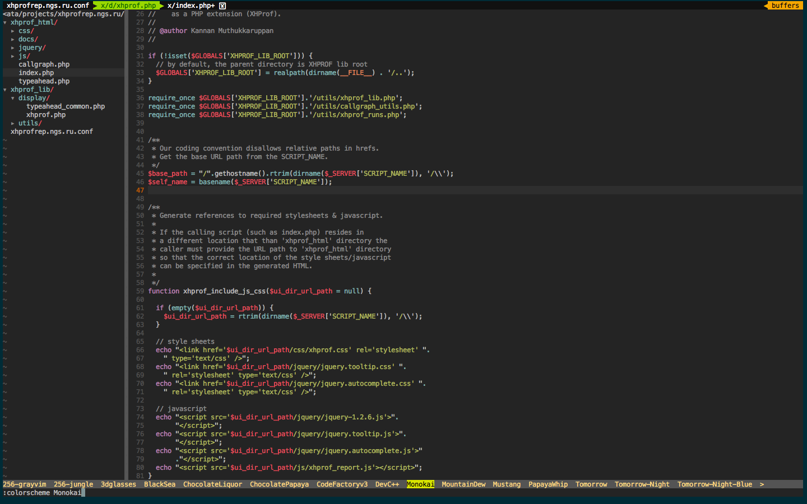

# Vim-php
It is Vim setup convinient for web-development, especially for php.
<center></center>

## Installation
1. Clone repository somewhere, for example:

 ```bash
 git clone https://github.com/sparfenov/vim-php.git ~/vim-php/
 ```
2. Run install script:

 ```bash
 ~/vim-php/install 
 ```
3. Configure `~/.vimrc` to make syntastic (php syntax and mess detector) work, set correct path to phpmd binary (find `let g:syntastic_php_phpmd_exec`)

4. To make available to jump straight to the methods - install [patched ctags](https://github.com/shawncplus/phpcomplete.vim/wiki/Patched-ctags)
 after, you can generate actual tags in vim: `,ct`

It is simple, it will just make symlinks for vim and vimrc to your home dir (old vim files will be moved to dotfiles.old) and install submodules (clone nesessary vim plugins)
