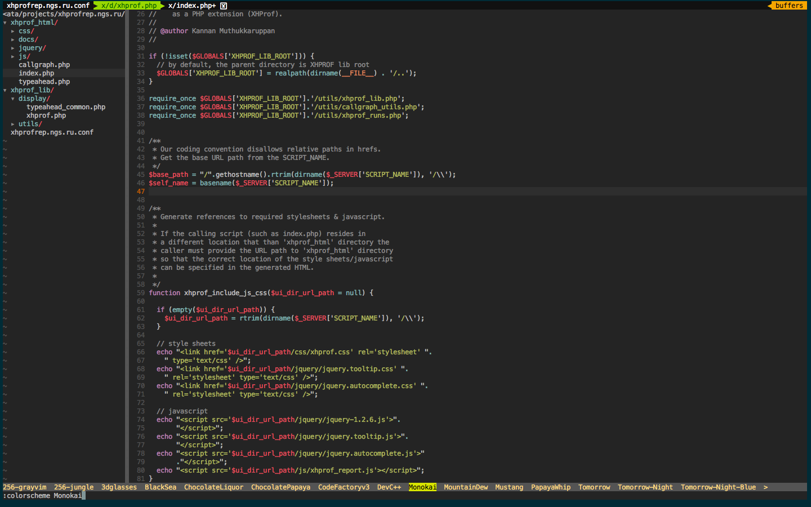

# Vim-php
It is Vim setup convinient for web-development, especially for php.

## Instalation
1. Clone repository somewhere, for example: git clone https://github.com/sparfenov/vim-php.git ~/vim-php/
2. Run install script: ~/vim-php/install 
It is simple, it will just make symlinks for vim and vimrc to your home dir(old vim files will be moved to dotfiles.old) and install submodules(clone nesessary vim plugins)
